<!-- PROJECT HEADER -->
<h1 align="center">🛍️ Retail Sales Analytics (SQLite • ANSI SQL)</h1>
<p align="center">
  <em>End-to-end mini analytics project I built to showcase clean SQL, data modeling, and business-ready insights.</em>
</p>

<p align="center">
  <a href="https://www.sqlite.org/">SQLite</a> •
  <a href="https://en.wikipedia.org/wiki/SQL">ANSI SQL</a> •
  Views • Window Functions • Triggers • CTEs
</p>

<p align="center">
  <a href="#-what-i-built">What I built</a> ·
  <a href="#-schema--data-model">Schema</a> ·
  <a href="#-run-it-locally">Run it locally</a> ·
  <a href="#-analytics-queries-included">Queries</a> ·
  <a href="#-highlights--talking-points">Highlights</a>
</p>

---

## 🚀 What I built
I designed a small but realistic **retail analytics** dataset and a suite of SQL artifacts that reflect how I actually work:
- A clear **relational schema** (customers, stores, products, orders, items, payments, inventory)
- **Views** and **CTEs** that keep logic DRY and easy to reuse
- **Window functions** for RFM scoring, YoY growth, cohort-like analyses
- A simple **trigger** to automatically maintain inventory when sales occur

The goal is to demonstrate my SQL fundamentals and analytics thinking in a way that's **runnable in minutes** and easy to scan during code reviews.

## 🧭 Why this project
When I think about analytics engineering jobs, I’m expected to do three things well:
1) design a sound model, 2) write readable SQL that scales conceptually, and 3) answer practical business questions.  
This repo shows all three in one place, without any heavy dependencies.

## 📦 Tech choices
- **SQLite-first** so you can clone and run right away.
- Written in **ANSI-style SQL**; porting to Postgres/MySQL is straightforward (minor date/trigger syntax changes).

---

## 🗂️ Repository Structure
```
.
├── schema.sql      # tables & constraints
├── seed.sql        # compact, realistic sample data
├── views.sql       # reusable analytic views
├── triggers.sql    # maintain inventory when orders are paid
└── queries.sql     # portfolio-ready analytics questions
```

---

## 🧱 Schema / Data Model
I kept the model practical and tidy—things you’d expect in a retail dataset.

```mermaid
erDiagram
  customers ||--o{ orders : places
  stores ||--o{ orders : fulfills
  orders ||--o{ order_items : contains
  products ||--o{ order_items : sold_as
  orders ||--o{ payments : has
  stores ||--o{ inventory : stocks
  products ||--o{ inventory : tracked_as

  customers {
    INTEGER customer_id PK
    TEXT first_name
    TEXT last_name
    TEXT email
    DATE created_at
  }
  stores {
    INTEGER store_id PK
    TEXT store_name
    TEXT city
    TEXT state
    DATE opened_at
  }
  products {
    INTEGER product_id PK
    TEXT product_name
    TEXT category
    NUMERIC unit_cost
    NUMERIC unit_price
    INTEGER active
  }
  orders {
    INTEGER order_id PK
    INTEGER customer_id FK
    INTEGER store_id FK
    DATE order_date
    TEXT status
  }
  order_items {
    INTEGER order_item_id PK
    INTEGER order_id FK
    INTEGER product_id FK
    INTEGER quantity
    NUMERIC unit_price
    NUMERIC discount
  }
  payments {
    INTEGER payment_id PK
    INTEGER order_id FK
    DATE paid_at
    TEXT method
    NUMERIC amount
  }
  inventory {
    INTEGER inventory_id PK
    INTEGER store_id FK
    INTEGER product_id FK
    INTEGER on_hand
    DATE last_updated
  }
```



---

## 🧪 Run it locally
I kept setup minimal—just SQLite.

```bash
# 1) Create and populate the database
sqlite3 retail.db < schema.sql
sqlite3 retail.db < seed.sql
sqlite3 retail.db < views.sql
sqlite3 retail.db < triggers.sql

# 2) Run the analytics (prints to console)
sqlite3 retail.db < queries.sql
```

> Tip: I often explore with **DB Browser for SQLite** for quick, visual checks.

---

## 📊 Analytics queries included
These are the kinds of questions I get asked by stakeholders, product managers, or marketing leads. I wrote them to be clean, modular, and reusable.

1. **Monthly KPIs** — revenue, order count, and AOV (average order value).  
2. **Top products by revenue and margin** — quick profitability read.  
3. **RFM segmentation** — recency/frequency/monetary scoring using window functions.  
4. **New vs. returning customers by month** — growth and retention view.  
5. **Store leaderboard with YoY growth** — performance across locations.  
6. **Cohort-style table** — first purchase month vs active month headcount.  
7. **Inventory coverage** — avg daily sales vs on-hand to estimate days of cover.  
8. **Category contribution margin** — margin %, revenue, and totals by category.  

> All of these use approachable patterns (CTEs + views) so it’s easy to expand.

---

## 🧠 A few design notes (how I think)
- **Snapshotting price at sale time** (`order_items.unit_price`) is critical for accurate historical revenue.  
- **Margin** is computed using item-level net price minus unit cost — surfaced via a reusable **view**.  
- **Inventory** is updated via a **trigger** when a paid order adds items; it’s intentionally simple but realistic.  
- I prefer **composable SQL** — complex questions are broken into small, testable pieces (CTEs / views).

---

## 🏁 What to look at first
- `views.sql` → `v_order_lines` and `v_orders` (they power most analytics)
- `queries.sql` → RFM & YoY examples (concise, review-friendly)

---

## 🔧 Portability
If you want Postgres/MySQL:
- Replace `strftime`/`julianday` with the engine’s date functions.
- Adjust trigger syntax as needed.
- Everything else is ANSI-friendly.

---

## 📬 Feedback / Ideas
If you have ideas to extend this—promotions, returns, taxes, or channel attribution—I’d love to riff on it. I kept the base small on purpose so it’s easy to read in interviews.

---

<p align="center">Made with ❤️ — I built this to reflect how I structure data work in the real world.</p>
